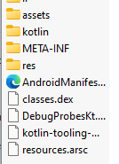

# Статья 1: Android, приложения

В рамках этой статьи мы изучим в большей части теорию, которая нам понадобится для этой лабораторной работы

## Что же такое приложение?

Если рассматривать `Android` как `Linux`, то приложение это, по сути, контролируемая среда в песочнице, работающей поверх ядра `Linux`. Давайте рассмотрим это чуть подробнее

### Схожести

- **Ядро**: И Android, и Linux имеют одну и ту же основу: ядро `Linux`. Это означает, что они "наследуют" некоторые общие вещи, например управление памятью, планирование процессов и т.д.
- **Управление пакетами**: Приложения для Android обычно упакованы в виде `APK` (`Android Package Kit`), содержащие все, что нужно приложению для запуска, включая код, ресурсы и всякие метаданные

### Различия

- **Выполнение**: `Android` использует свою собственную среду выполнения под названием `ART` (`Android Runtime`) для выполнения приложений. Это предоставляет дополнительные функции, например компиляция `Ahead-of-time`

### Какие бывают приложения?

На данный момент существует 2 способа распространения приложений:
- `APK`: универсальный и подходящий для любого устройства пакет
- `AAB` (`Android App Bundle`): содержат в себе отдельные компоненты приложения. Если простым языком, то разработчик создает `AAB`, загружает его в `Google Play`, а когда вы скачиваете, то качаете только нужные вам компоненты (нативные библиотеки для архитектуры вашего процессора, русский язык, картинки для вашего размера экрана и т.д.)

Мы с вами в рамках данной лабораторной работы будем рассматривать только `.apk` файлы

### Что же такое приложение?

На самом деле `.apk` файл - просто `.zip` архив. Да, можете изменить расширение файла и открыть его, увидите, что там внутри. Рассмотрим на примере:

Что же это за файлы?
- `assets`: тут лежат разные файлы, которые могут понадобиться приложению (например `.html`, `.mp3`, `.json`)
- `kotlin`: тут лежат файлы, которые нужны для работы разных фишек языка `Kotlin`
- `META-INF`: тут лежат файлы, которые будет смотреть `Java Virtual Machine` при загрузке приложения (всякие метаданные). Раньше тут еще была информация о подписи приложения (обсудим это чуть позже)
- `res`: здесь лежат все ресурсы (картинки, иконка, разметка и т.д.), но открыть вы их все равно не сможете, они там в двоичном формате для более быстрой работы приложения
- `AndroidManifest.xml`: этот файл является критически важным компонентом каждого приложения. Это как план, который сообщает системе все, что ей нужно знать о вашем приложении, например, разрешения, компоненты и т.д.
- `classes.dex`: это сам код, скомпилированный, конечно
- `resources.arsc`: этот файл содержит всю метаинформацию о ресурсах
- `lib`: в данном случае этой папки нет, но иногда есть. Там хранятся нативные библиотеки для разных архитектур процессоров, такой код намного быстрее, обычно туда выносят тяжелую работу, например, обработку изображений

Ну, вроде на этом и можно закончить нудную теорию, материала реально мало, если вдруг вас что-то заинтересовало, то всегда есть `AI`, который ответит на ваши вопросы (ну или `Google`)

### А что с ними делать?

Файлы то вроде в бинарном формате, как их редактировать? Дальше разберемся!

# Навигация

- [Задание](../README.md)
- **Статья 1: Android, приложения**
- [Статья 2: ApkTool](./APKTOOL.md)
- [Статья 3: JADX](./JADX.md)
- [Статья 4: Основы Smali](./SMALI-BASIC.md)