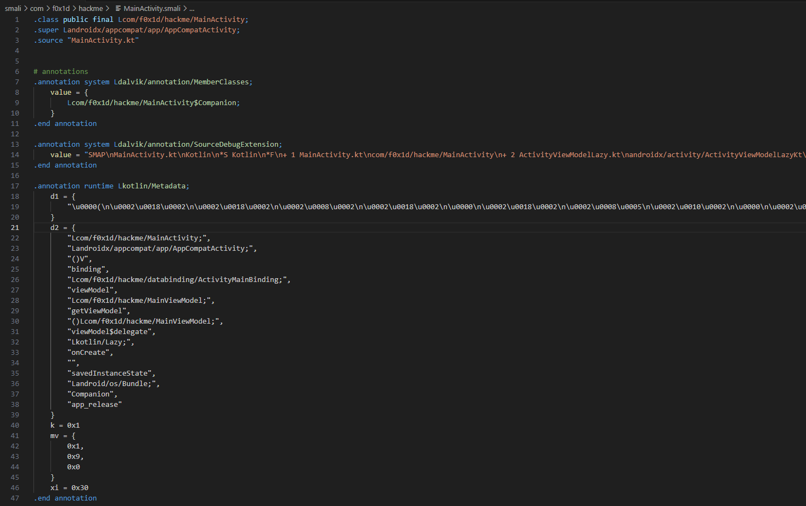

# Статья 4: Структура Smali

Тут мы уже чуть начнем разговор о `Smali`

## Структура файлов

В своём декомпилированном приложении вы можете увидеть папку `smali`, а иногда и `smali_classes2`, `smali_classes3`, `smali_classes...`. 
Очевидно, что именно там и находятся наши файлы `.smali`. Каждая из этих папок - декомпиляция соответственного `classes.dex` (да, их может быть больше 1, например, `classes2.dex`). Это происходит из-за того, что в каждом `.dex` файле может быть только максимум 65536 методов

### А что внутри?

Внутри этих папок, как не странно, другие папки. Но эти папки уже являются пакетами (это из `Java`, можно интерпретировать как "папки, чтобы структурировать файлы с кодом" или "пространства имён"). Чаще всего вы можете увидеть `com`, `ru`, `io`, `org` и т.д. И лишь пройдя чуть дальше мы увидим сами наши файлы `.smali`

## Структура файла Smali



Ну да, выглядит не очень, давайте разбираться!

Каждый `.smali` файл - соотвествующий класс или интерфейс, поэтому с самого верха идет следующая структура:
- `.class Lпакет/к/этому/классу;`, у интерфейса чуть другое, можете сами поискать и посмотреть. Еще иногда можно заметить что-то типо `.class Lorg/cool/Something$Cool`, это показывает, что текущий класс/интерфейс (`Cool`) является вложенным в `Something`
- `.super Lпакет/к/родительскому/классу;`, от кого этот класс наследуется (привет ООП)
- `.source "Название исходного файла.java"`, но не всегда, обычно минификация это трёт, об этом ниже
- `.implements Lпакет/к/классу/который/реализуем;`, если текущий класс вдруг реализует интерфейс

Вроде это самое основное, что вы можете увидеть сверху, дальше уже идут глобальные переменные и сами методы, например:
```smali
.class public Lcom/google/android/material/badge/BadgeDrawable; # текущий класс
.super Landroid/graphics/drawable/Drawable; # наследует вот это
.source "BadgeDrawable.java" # исходно был в этом файлике

# реализует этот интерфейс
.implements Lcom/google/android/material/internal/TextDrawableHelper$TextDrawableDelegate;


# такие в нем статические переменные
.field public static final BADGE_CONTENT_NOT_TRUNCATED:I = -0x2

.field static final BADGE_RADIUS_NOT_SPECIFIED:I = -0x1

.field private static final DEFAULT_STYLE:I

.field private static final DEFAULT_THEME_ATTR:I


# такие в нем глобальные переменные
.field private final badgeBounds:Landroid/graphics/Rect;

.field private badgeCenterX:F

.field private badgeCenterY:F

# статический конструктор класса
.method static constructor <clinit>()V
    .locals 1

    .line 168
    sget v0, Lcom/google/android/material/R$style;->Widget_MaterialComponents_Badge:I

    sput v0, Lcom/google/android/material/badge/BadgeDrawable;->DEFAULT_STYLE:I

    .line 169
    sget v0, Lcom/google/android/material/R$attr;->badgeStyle:I

    sput v0, Lcom/google/android/material/badge/BadgeDrawable;->DEFAULT_THEME_ATTR:I

    return-void
.end method

# а это уже сам конструктор класса
.method private constructor <init>(Landroid/content/Context;IIILcom/google/android/material/badge/BadgeState$State;)V
    .locals 8

    .line 306
    invoke-direct {p0}, Landroid/graphics/drawable/Drawable;-><init>()V

    # там что-то еще было, я обрезал

    return-void
.end method
```

Мы разберем большую часть из этого (основы) в следующих статьях!

## Минификация

Чаще всего вы не увидите такой красивый файл `.smali`, даже не файл, еще и пакеты. А всё из-за минификации! Ее основное предназначение в уменьшении размера приложения

Как она работает? Все просто: был `com.f0x1d.logfox.repository.logging.CrashesRepository`, а после сборки стал `a.a.a.a.a.a`, ну и вместо всех методов и переменных теперь тоже буковки `a`, `b`, `c` и т.д. Зачем? Потому что `a.a.a.a.a.a` сильно меньше места занимает в сравнении с `com.f0x1d.logfox.repository.logging.CrashesRepository`. Конечно, она еще применяет и другие методы оптимизации, например, удаляет неиспользуемый код и т.д.

Еще минификацию применяют для предотвращения реверс-инжиниринга (это как раз то, чем мы тут занимаемся). Согласитесь, вам ведь будет намного труднее ориентироваться в файлах, если вместо нормальных названий вы будете видеть какие-нибудь китайские иероглифы, а может что и еще хуже, например вот:


# Навигация

- [Задание](../README.md)
- [Статья 1: Android, приложения](./APPS.md)
- [Статья 2: ApkTool](./APKTOOL.md)
- [Статья 3: JADX](./JADX.md)
- **Статья 4: Структура Smali**
- [Статья 5: Переменные и методы в Smali](./SMALI-VARS-METHODS.md)
- [Статья 6: Get started в Smali](./SMALI-GET-STARTED.md)